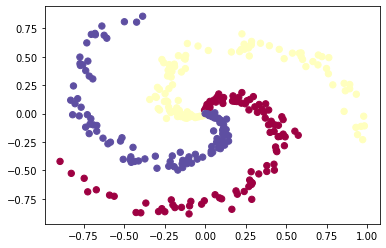
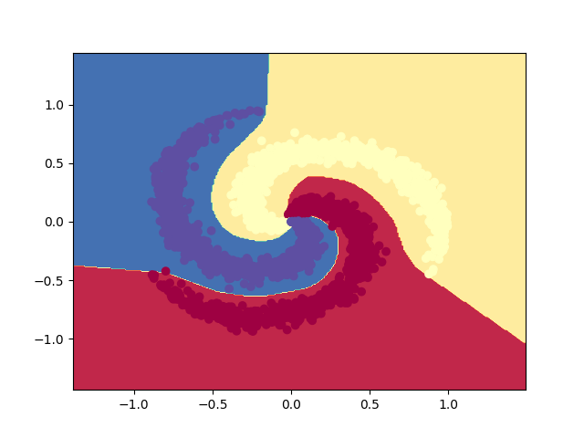
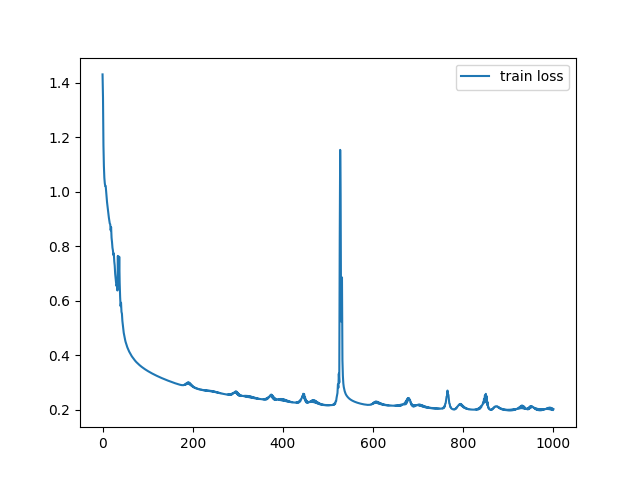
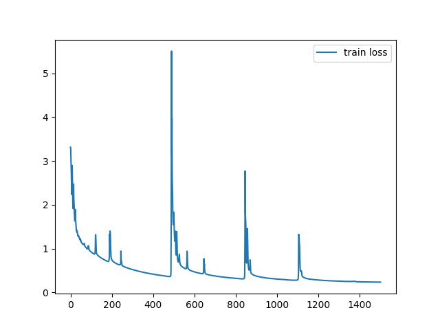

# ANN Exercise

## Create an ANN from scratch

Tạo một mạng ANN chỉ sử dụng thư viện numpy. Exercise này được lưu trong folder NeuralNetwork.

### Một số chức năng:

- Có các method gồm: add(), summary(), fit(), accuracy_score(), plot_history()
- Có thể sử dụng 5 activation: sigmoid, tanh, ReLU, LeakyReLU, ELU (phải viết đúng tên mới sử dụng được)
- Có thể thêm regularization l1 hoặc l2
- Một số hyperparam: epochs, learning_rate, batch_size, reg (lambda)
- Visualize decision boundary  # Copy from Andrej Karpathy (cs231n course)
- Sử dụng hàm Softmax (layer cuối) để tạo Multi Classier
- Sử dụng hàm sigmoid (layer cuối) để tạo binary Classier # (Còn bug!!)

### Kết quả:

Mạng sử dụng:

## Nhận diện chữ viết tay bộ data MNIST

### Kết quả

Mạng sử dụng để phân loại:

