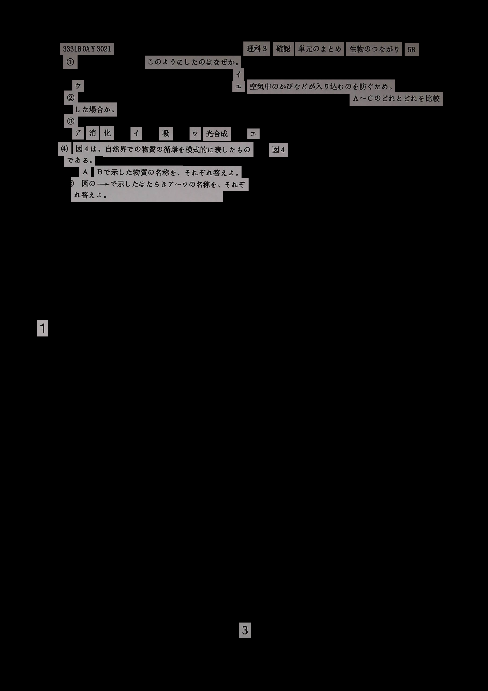
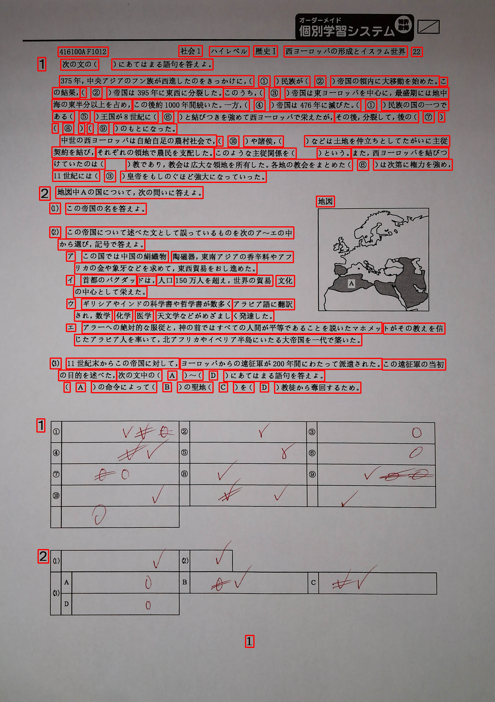
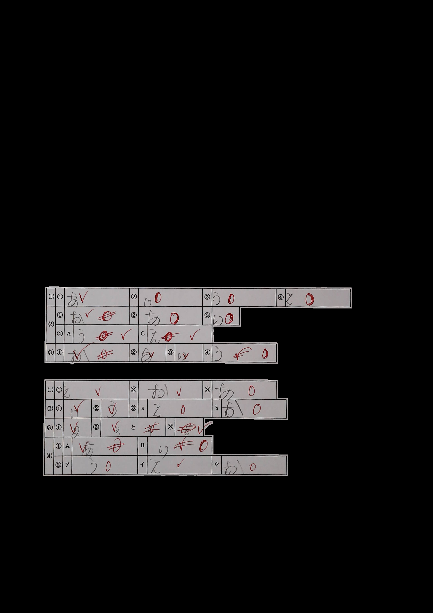
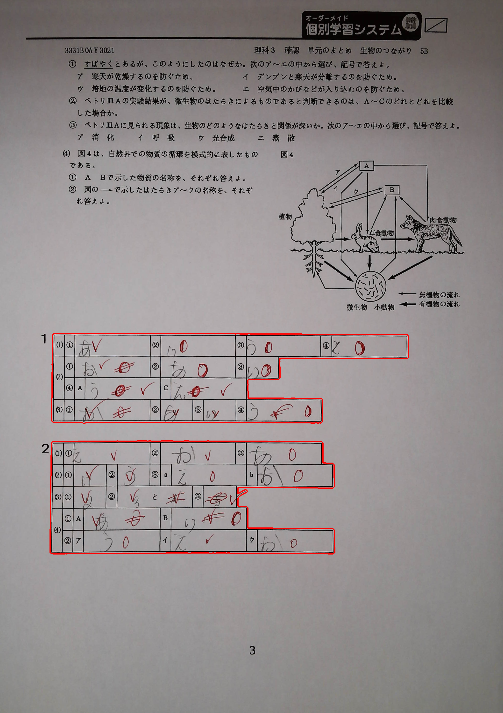
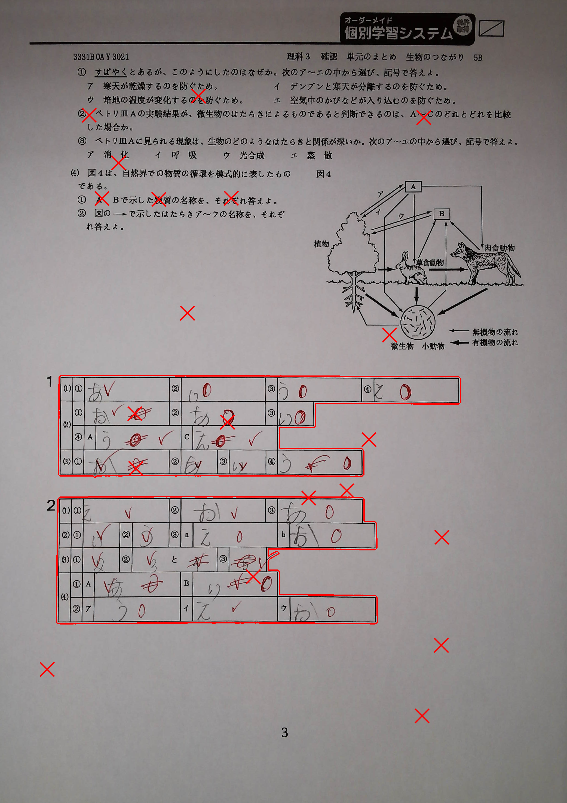
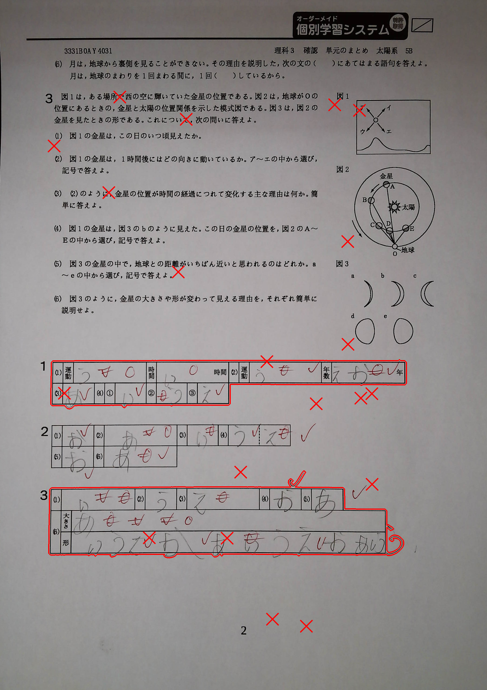

# OPENCV EXERCISES

## Link Driver kết quả cho các Exercise:

https://drive.google.com/drive/folders/1mSYAJd-TZsJORK5GQtZ-feR-37HG8QXl?usp=sharing

## 1. Text Detector
Mục tiêu của bài tập này xác định và vẽ bounding box cho các phần text trên bức ảnh cho trước.

Mình sử dụng phép CandyEdges để xác định các đường cạnh, sau đó dùng phép dilation để có thể xác định rõ hơn các đường này.

Cuối cùng, tìm contour và filter các contour để chỉ lấy các phần chứa text.

Kết quả như sau:

## 2. Big Question Detector
Ở bài này, mình cần xác định các contour của các câu hỏi lớn (big question).

Vẫn tương tự như ở bài 1, mình xác định cạnh và xử lý các phép biến đổi để xác định được contour cho các Big Question.

Kết quả như sau:

## 3. None Tictoe Ignore
Bài cuối cùng, ta define ngẫu nhiên các dấu tic toe ở hình. Và loại bỏ các big question không chứa bất kỳ dấu tic toe nào.

Ở đây, mình sử dụng hàm cv2.pointPolygonTest() để xác định được các dấu tic toe có nằm trong big question hay không.
Hàm số này trả về các giá trị {1, -1, 0}, tương ứng các vị trí nằm trong, nằm ngoài và nằm trên contour của big question.

Kết quả:

